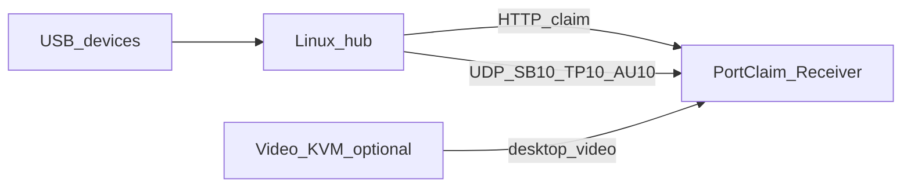
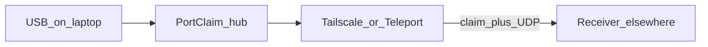

# PortClaim — USB/HID software KVM

LAN claim fabric for input devices. A dedicated Linux USB hub owns the
physical ports, the device drivers, and the on-wire protocols. Any machine
with a Receiver **claims** a device from a dropdown and injects. Desktop
video stays on a **software KVM** (Apollo / Artemis is one example). This
is not usbip and not a game plugin.

Site IPs, keys, and tokens belong in env vars or a local `ONBOARDING.md`
(gitignored). This README is the public map: product, protocol, how to
deploy a hub, and how to hang extra mappers off a claim.

Display name is **PortClaim** (one PascalCase token). Slug `portclaim`.
systemd `usb-loom-hub`, env `USB_LOOM_*`, and header `X-Usb-Loom-Token`
are compatibility aliases until a dedicated hub cut.

---

## Why this exists

Three planes share a desk. They are not substitutes.

| Plane | What it is good at | What it does not do |
|-------|--------------------|---------------------|
| Hardware KVM | A general electrical path. Wake a machine. No protocol in the middle. The switch does not care which keyboard layout you bought. | Per-device claim. Drivers on a host that is not the switched USB target. |
| Software KVM | Desktop **video and audio** over the LAN, plus a mouse/keyboard path so a thin client can sit the session. Apollo + Artemis is one stack (Sunshine-class host, Shield / Android / other clients). | HID is whatever that **receiver hardware** already knows. Generic, predefined input. You cannot claim a Trackpad or a stick as a first-class device on that path. |
| PortClaim | USB/HID **claim fabric**. Linux on the hub interprets the physical device. Compatibility is the hub, not the video client. Thin Receivers inject. | Raw USB pass-through. Not a hardware KVM wake path. Not the video plane. |

Software KVM is good at the picture. It is a weak interpreter. Alt-Tab and
other OS hotkeys often never leave the client because that box — in one
common layout an NVIDIA Shield Pro running Artemis on Android — only
forwards what *its* OS can capture. A Norwegian keyboard on that Shield
does not become a Norwegian keyboard on the host; Android ate the keys.
You still get “a keyboard,” just not yours.

That is why PortClaim puts the interpreter on the dedicated USB hub (the
X200 example), not on the video client. Linux HID on the hub decides
what the device is. The Receiver is dumb inject. Apollo / Artemis can
keep the desktop; they should not be asked to be a Magic Trackpad or a
layout-accurate keyboard.

Daily surface: open the Receiver, pick a device in the dropdown, Claim.
Unclaimed devices stay silent. Switch the sink by claiming from another
machine — host-agnostic, and Receiver-agnostic in the driver sense.

### How a Receiver stays dumb

The hub runs Linux HID/audio drivers (for example `hid-magicmouse`, xpad,
ALSA). A Magic Trackpad is an MT node there, not an Apple HID device on
Windows. The hub encodes a stable LAN protocol (TP10 contacts, SB10 HID,
AU10 PCM). The Receiver never installs Apple, Thrustmaster, or Elite
drivers.

The hub does not recognize gestures. `hub/trackpad.py` streams contacts.
GestureEngine / ViGEm / VB-CABLE on the claimed sink speak the local OS
(SendInput on Windows). Capture and drivers on the hub; inject on the
Receiver.

### Origin

Hardware KVM extenders often carry keyboard and mouse only, and software
KVM (Apollo / Artemis as one example) adds video plus a generic input
path. A stick, a trackpad, and a USB mic still have no honest path to
the battlestation. PortClaim is that USB plane beside the video KVM.
The product is the claim fabric, not a single joystick.

---

## Protocol

```
Hub  (systemd usb-loom-hub)
  HTTP control            :27180
  SB10 ta320              UDP → claimed dest (default :27182)
  AU10 mic                UDP → claimed dest (default :27183)
  TP10 magictrackpad      UDP → claimed dest (default :27184)  125 Hz incl. empty frames
  SB10 xboxelite          UDP → claimed dest (default :27185)

Receiver sinks
  Sidestick / ViGEm map   :27182  → Xbox 360 (T.A320)
  mic_sink                :27183  → CABLE Input (VB-CABLE)
  GestureEngine           :27184  → SendInput (inside frozen Receiver)
  xbox_sink               :27185  → identity ViGEm Xbox 360
  PortClaim.exe           mapping UI; owns :27184 when healthy
```

Health: `GET /v1/health`. Inventory: `GET /v1/devices`. Auth: header
`X-Usb-Loom-Token` (see Site config).

Adapters: `ta320` `:27182`, `magictrackpad` `:27184`, `mic` `:27183`,
`xboxelite` `:27185`.

---

## Site config (env, not git)

Fail closed. There is no baked hub IP, dest IP, or token in the tree.

| Variable | Role |
|----------|------|
| `USB_LOOM_TOKEN` | Shared secret. Sent as `X-Usb-Loom-Token`. Required on hub and client. |
| `USB_LOOM_HUB` | Control URL, `http://HUB:27180` (LAN or overlay IP). |
| `USB_LOOM_SELF` | Receiver address the hub can reach (LAN or overlay). |
| `USB_LOOM_SSH_TARGET` | `root@HUB` for `deploy/Deploy-Hub.ps1`. |
| `USB_LOOM_SIDESTICK` | Optional path to SidestickBridge (T.A320 → ViGEm). |

On the hub node, `deploy/install.sh --token …` writes `/etc/usb-loom.env`.
Copy `deploy/usb-loom.env.example`; never commit a filled `.env`.

A working kit may keep a local `ONBOARDING.md` (gitignored) for IPs and
keys. Do not copy that file into git.

```powershell
# Receiver / claim.py — fill with your LAN, not placeholders
$env:USB_LOOM_TOKEN = "…"
$env:USB_LOOM_HUB = "http://HUB:27180"
$env:USB_LOOM_SELF = "DEST"
```

---

## Deploying a hub

### Requirements (any Linux USB host)

- A dedicated machine owns the physical USB ports. That is not the
  battlestation.
- Headless, always-on. USB ports stay powered. HID must not autosuspend.
- LAN-first. Control HTTP `:27180`. This is a claim fabric, not usbip.
  Do not publish those ports on the public internet. Overlay VPN is how
  a Receiver off-site still looks local (see Portable hub).
- `deploy/install.sh --token $USB_LOOM_TOKEN` installs systemd
  `usb-loom-hub`, udev `99-usb-loom.rules`, and
  `/usr/local/lib/usb-loom/`.
- `deploy/always-on.sh` — lid/sleep ignored so a docked laptop stays up.
- `deploy/dock-usb.sh` — dock/hub ports powered; USB autosuspend off.
- Optional: `deploy/cpu-quiet.sh` (governor), `deploy/fan-quiet.sh`
  (thinkfan). Neither restarts the hub unit.

```powershell
scp -i $KEY -o IdentitiesOnly=yes -r hub proto deploy client root@HUB:/tmp/usb-loom/
ssh -i $KEY -o IdentitiesOnly=yes root@HUB "sed -i 's/\r$//' /tmp/usb-loom/deploy/*.sh; rm -f /tmp/usb-loom/deploy/usb-loom.env; sh /tmp/usb-loom/deploy/install.sh --token $USB_LOOM_TOKEN"
```

Windows `scp` does not take comma-separated local files. Use `-r` on dirs.
`install.sh` restarts `usb-loom-hub`. Do not run it for Receiver-only work.

### Example appliance — ThinkPad X200 + Proxmox, headless

One proven layout. Not the product. Any quiet Linux USB host can fill the
same role.

- ThinkPad X200 in an Ultrabase, lid closed. Console is SSH.
- Proxmox VE on the metal. The hub runs on the **host**, not an LXC, while
  RAM is tight (~4 GiB class). Guests later if the box can spare them.
- Dock USB stays powered. `hid-magicmouse`, xpad, and ALSA live here.
- PVE defaults the CPU governor to `performance` (guest-clock stability).
  An appliance with no guests can park `ondemand` (`cpu-quiet.sh`). Do not
  set `powersave` on `acpi-cpufreq` — that locks min clock. Fan: thinkfan,
  not TLP (`fan-quiet.sh`).
- Genesis devices on that dock: Thrustmaster T.A320, Apple Magic Trackpad,
  USB condenser mic, Xbox Elite — adapters `ta320`, `magictrackpad`,
  `mic`, `xboxelite`.

The X200 is one way to build the left box:



Video (Apollo / Artemis, or anything else) is optional and a separate
plane. PortClaim does not carry the desktop.

### Portable hub — travel laptop + overlay VPN

**Off-LAN claim is untested.** Tailscale, UniFi Teleport, travel Wi-Fi,
and a hub that leaves the desk are design notes, not a verified path.
Do not count them as proven or as a security boundary. The token is a
LAN shared secret, not a remote-access audit. What *is* proven is a
wired LAN hub and Receiver.

An old laptop is a USB appliance you can pack. The X200 example is a
docked always-on hub at home; the same class of machine can leave the
desk with the devices still plugged into *it*. The Receiver stays on
whatever machine you are actually using.

The fabric still speaks LAN HTTP + UDP. To claim from outside that LAN,
put hub and Receiver on the same overlay — **Tailscale**, **UniFi
Teleport**, or another mesh VPN — and point `USB_LOOM_HUB` /
`USB_LOOM_SELF` at overlay addresses, not at a public IP.



- Do not port-forward `:27180`–`:27185` to the internet. The token is
  not a WAN ACL.
- HID and AU10 are latency-sensitive. Overlay is “same fabric, farther
  away,” not a substitute for a tight LAN. Trackpad and stick feel the
  RTT; video still belongs on its own plane (Sunshine/Apollo, or the
  overlay’s own desktop path).
- Bring the hub, not the battlestation: drivers stay on the laptop, the
  Receiver elsewhere injects.

Two different jobs. Do not mix them.

**Hub stays home (static ethernet).** Proxmox `vmbr0` on a wired NIC with
a site static IP is the easy case. The X200 never leaves the LAN. You
run Tailscale or UniFi Teleport on the *Receiver* (phone, travel
laptop). That overlay reaches the home subnet; `USB_LOOM_HUB` is still
the hub’s LAN address. Wi-Fi on the X200 can stay down.

**Hub travels with you.** The static `vmbr0` address is a *home*
profile. On a phone hotspot that subnet and gateway do not exist. Leave
ethernet as-is for the desk; add a **separate** Wi-Fi (or USB-ethernet)
interface with DHCP. Do not put the home static IP on `wlan0`. Do not
bridge STA Wi-Fi into `vmbr0` — Proxmox will not do that in client
mode.

A phone running UniFi Teleport and sharing a hotspot is only **uplink
NAT**. The X200 sits behind the phone. Home (and a Receiver on
Teleport) can talk to the *phone*, not to `:27180` on the X200.
Inbound claim needs the overlay **on the Proxmox host** (Tailscale is
the Linux-native fit; Teleport’s client is not a PVE citizen). Then
`USB_LOOM_HUB` / `USB_LOOM_SELF` are overlay addresses, stable whether
the uplink is dock ethernet or hotspot Wi-Fi.

If the Receiver is on the *same* hotspot as the X200, that is already a
tiny LAN: DHCP on both, no overlay required. The home static IP still
must not be used there.

X200 Wi-Fi (iwl3945-class) under Proxmox is the weak link. A USB
ethernet dongle to a travel router, or a phone tether that the host
runs Tailscale over, is more honest than bridging a 2008 wireless card
into PVE.

---

## Receiver

Windows mapping surface. Freeze with `deploy/Build-Receiver.ps1`:

`%LOCALAPPDATA%\portclaim\Receiver\PortClaim.exe`

Pin that exe, not `python.exe`. Trackpad settings:
`%LOCALAPPDATA%\portclaim\trackpad.json` (first run copies a legacy
`usb-loom\trackpad.json` if present).

Fill Hub and Dest in the window, or set `USB_LOOM_HUB` / `USB_LOOM_SELF`
/ `USB_LOOM_TOKEN`. One process must own UDP `:27184`.

```powershell
Get-NetUDPEndpoint -LocalPort 27184 | ForEach-Object { Stop-Process -Id $_.OwningProcess -Force }
.\deploy\Build-Receiver.ps1
Start-Process "$env:LOCALAPPDATA\portclaim\Receiver\PortClaim.exe"
# prove owner is PortClaim, not python
```

```powershell
python client\claim.py --hub http://HUB:27180 devices
python client\claim.py --hub http://HUB:27180 claim magictrackpad --dest DEST:27184
```

Handy records **CABLE Output**. Point it there. Steam Streaming Microphone
is leftover Remote Play hardware.

```powershell
python -m unittest test_trackpad_gestures
```

from `client/`.

---

## Extending a claim

PortClaim **claims the port** and delivers a stable LAN stream. It does
not have to be the last mapper.

**Pattern:** hub adapter → UDP to Dest:port → sidecar on the Receiver
host → what the OS or game sees.

| Adapter | On-wire | Sidecar example | What the OS sees |
|---------|---------|-----------------|------------------|
| `ta320` | SB10 `:27182` | SidestickBridge → ViGEm Xbox 360 | Gamepad (not raw Thrustmaster HID) |
| `magictrackpad` | TP10 `:27184` | GestureEngine inside PortClaim | SendInput pointer / scroll / mark |
| `mic` | AU10 `:27183` | `mic_sink` → VB-CABLE | CABLE Output for Handy / Discord |
| `xboxelite` | SB10 `:27185` | `xbox_sink` identity ViGEm | Xbox 360 pad (not SidestickBridge) |

### Example — T.A320 + SidestickBridge + Starfield

Starfield (and anything that wants an Xbox pad) does not speak a
Thrustmaster sidestick on Windows. PortClaim still owns the physical
port. A sidecar does the game-facing map.

1. Hub: Linux sees the T.A320. PortClaim claims `ta320` to `DEST:27182`
   (SB10). No Thrustmaster driver on the Receiver.
2. SidestickBridge (separate tree; path in `USB_LOOM_SIDESTICK`) listens
   on `:27182` and injects a **ViGEm Xbox 360** pad. Starfield sees that
   pad.
3. The Receiver T.A320 pane only claims the stick and can open that map.
   It does not ship a Starfield curve. Tune the map in SidestickBridge.

Do not share SidestickBridge between the stick and the Elite. `xboxelite`
uses `client/xbox_sink.py` (identity ViGEm on `:27185`).

Same idea for other games or apps: keep the claim fabric, swap or add the
sidecar that the title actually wants.

---

## Gesture contract (Magic Trackpad `05AC:0265`)

Client-side only. Hub `hub/trackpad.py` streams TP10. Engine:
`client/trackpad_sink.py` (`GestureEngine`). Receiver settings file on the
sink host. Tests: `client/test_trackpad_gestures.py`.

| Fingers | Does | Does not |
|---------|------|----------|
| One | Pointer + click (tap or physical pulse) | Drag-to-select, sticky mark, click-drag |
| Two | Scroll + flick coast | Click, right-click, mark, pinch zoom |
| Three | Sticky mark (left-down + move), 3→2/4/1 flicker keeps the mark | Swipe, back/forward |

Hard rules (forced in config clamp, not checkboxes):

- `click_drag = False` — one finger never holds left for OLE/select.
- `secondary = "off"` — two-finger tap/click never emits mouse buttons.
- `pinch_zoom = False` — two-finger never holds Ctrl or zooms; use Ctrl+/Ctrl-.
- `three_finger_drag = True` — three contacts are a sticky click. No 3-finger swipe.
  After a mark, a one-finger move ends the mark and goes back to pointer. A short
  unmoved tap ends the mark and clicks. Do not park `SM_CXDRAG` during the
  stroke: that mute also kills window-drag (Cursor/Electron uses the same
  threshold). `serve()` still restores drag width to 4 so a killed Receiver
  cannot leave 20000 behind.

Flick coast (two-finger lift only):

- Three gears from a ~150 ms velocity estimate: none / soft tap / firm hit.
  A slam is firm, not a fourth speed. No analog `v0`. Receiver sliders:
  flick force (default 5 → snap 70) and flick friction (default 5 → 26).
- Decay is not a slider. At lift, k = κ a / v0 with κ from the snap-52 ice
  (1.2 × 52 / 26). Soft tap stays 34. Live two-finger drag stays analog.
- Per-frame wheel cap 8 so Cursor/Electron do not skip. Touch cancels the coast.
- Empty 125 Hz hub frames tick the coast. That is why the hub must keep
  sending empty TP10 frames.

OS-chrome swipes (Mission Control, desktop switch) are still mostly off.

---

## Layout

| Path | Role |
|------|------|
| `hub/server.py` | Claim/inventory HTTP |
| `hub/hid.py` | T.A320 + Xbox Elite adapters |
| `hub/trackpad.py` | Magic Trackpad → TP10 @ 125 Hz |
| `hub/audio.py` | Mic → AU10 |
| `client/trackpad_sink.py` | GestureEngine (SendInput) |
| `client/trackpad_config.py` | Settings load/save/clamp |
| `client/test_trackpad_gestures.py` | Gesture unit tests |
| `client/receiver_app.py` | Mapping window; starts sinks if ports free |
| `client/mic_sink.py` | AU10 → VB-CABLE |
| `client/xbox_sink.py` | XB10 → ViGEm identity pad |
| `client/claim.py` | `devices` / `claim` / `release` / `connect` |
| `proto/` | SB10, AU10, TP10, XB10 constants |
| `client/PortClaim.spec` | Frozen `PortClaim.exe` |
| `deploy/Build-Receiver.ps1` | Freeze + install Receiver (`%LOCALAPPDATA%\portclaim\`) |
| `deploy/install.sh` | Node package + unit |
| `deploy/always-on.sh` | Lid/sleep ignore |
| `deploy/dock-usb.sh` | Dock USB powered, autosuspend off |
| `deploy/cpu-quiet.sh` | Optional host CPU governor |
| `deploy/fan-quiet.sh` | Optional thinkfan curve |
| `deploy/usb-loom.env.example` | Empty token template |

---

## Operator notes

1. **One owner of `:27184`.** A leftover `python client/trackpad_sink.py` steals
   the port; the Receiver then skips its sink and gestures go stale. Kill the
   thief; start one Receiver.
2. **Stop the live Receiver before `Build-Receiver.ps1`.** Robocopy `/MIR`
   cannot overwrite a locked exe. Stop → build → start.
3. **Do not bounce the hub** for Receiver/gesture work. Mic claim drops.
4. **Do not start a second `trackpad_sink.py`** to “help.”
5. Hub changes need `install.sh` on the node. Client-only gesture work does not.
6. Windows `scp` does not take comma-separated local files. Use `-r` on dirs.

---

## Not done yet

- 3/4-finger OS chrome (Mission Control, desktop switch) — mostly off.
- usbip / raw USB pass-through.
- Per-client names / token rotation.
- Moving the hub into an LXC (host is correct until RAM says otherwise).
- Off-LAN / overlay VPN (Tailscale, UniFi Teleport, travel hub): untested.
  Not verified. Not a security claim.
- Renaming systemd `usb-loom-hub` / `USB_LOOM_*` to PortClaim (needs a hub cut).
