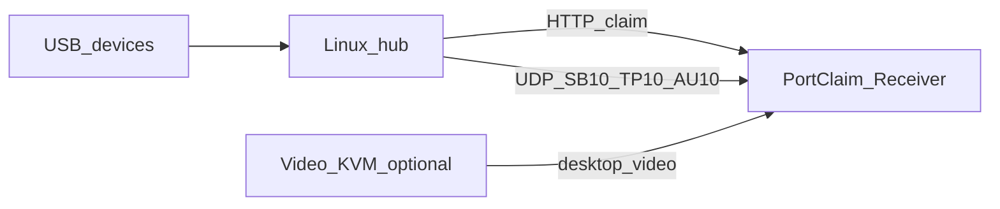
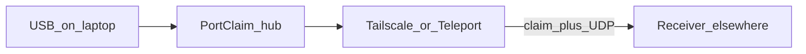
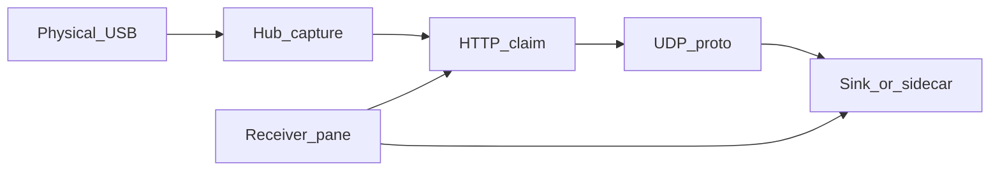

# PortClaim — USB/HID software KVM

LAN claim fabric for input devices. A dedicated Linux USB hub owns the
physical ports, the device drivers, and the on-wire protocols. Any machine
with a Receiver **claims** a device from a dropdown and injects. Desktop
video stays on a **software KVM** (Apollo / Artemis is one example). This
is not usbip and not a game plugin.

Site IPs, keys, and tokens belong in env vars or a local `ONBOARDING.md`
(gitignored). This README is the public map: product, protocol, how to
deploy a hub, and how to hang extra mappers off a claim.

Display name is **PortClaim** (one PascalCase token). Slug `portclaim`.
That is the product. **usb-loom** is the engine: systemd `usb-loom-hub`,
env `USB_LOOM_*`, header `X-Usb-Loom-Token`, `/usr/local/lib/usb-loom/`.
Those names stay. They are not a rename backlog.

---

## Why this exists

Three planes share a desk. They are not substitutes.

| Plane | What it is good at | What it does not do |
|-------|--------------------|---------------------|
| Hardware KVM | A general electrical path. Wake a machine. No protocol in the middle. The switch does not care which keyboard layout you bought. | Per-device claim. Drivers on a host that is not the switched USB target. |
| Software KVM | Desktop **video and audio** over the LAN, plus a mouse/keyboard path so a thin client can sit the session. Apollo + Artemis is one stack (Sunshine-class host, Shield / Android / other clients). | HID is whatever that **receiver hardware** already knows. Generic, predefined input. You cannot claim a Trackpad or a stick as a first-class device on that path. |
| PortClaim | USB/HID **claim fabric**. Linux on the hub interprets the physical device. Compatibility is the hub, not the video client. Thin Receivers inject. | Raw USB pass-through. Not a hardware KVM wake path. Not the video plane. |

Software KVM is good at the picture. It is a weak interpreter. Alt-Tab and
other OS hotkeys often never leave the client because that box — in one
common layout an NVIDIA Shield Pro running Artemis on Android — only
forwards what *its* OS can capture. A Norwegian keyboard on that Shield
does not become a Norwegian keyboard on the host; Android ate the keys.
You still get “a keyboard,” just not yours.

That is why PortClaim puts the interpreter on the dedicated USB hub (the
X200 example), not on the video client. Linux HID on the hub decides
what the device is. The Receiver is dumb inject. Apollo / Artemis can
keep the desktop; they should not be asked to be a Magic Trackpad or a
layout-accurate keyboard.

Daily surface: open the Receiver, pick a device in the dropdown, Claim.
Unclaimed devices stay silent. Switch the sink by claiming from another
machine — host-agnostic, and Receiver-agnostic in the driver sense.

### How a Receiver stays dumb

The hub runs Linux HID/audio drivers (for example `hid-magicmouse`, xpad,
ALSA). A Magic Trackpad is an MT node there, not an Apple HID device on
Windows. The hub encodes a stable LAN protocol (TP10 contacts, SB10 HID,
AU10 PCM). The Receiver never installs Apple, Thrustmaster, or Elite
drivers.

The hub does not recognize gestures. `hub/trackpad.py` streams contacts.
Windows uses GestureEngine / ViGEm / VB-CABLE. Linux forwards lossless
contacts into a native uinput touchpad so libinput and Wayland handle input;
its gamepad uses uinput and its microphone uses PipeWire. Capture and drivers
on the hub; OS interpretation and injection on the Receiver.
See [Native Linux touchpad](docs/native-touchpad.md) for the protocol and upgrade.

### Origin

Hardware KVM extenders often carry keyboard and mouse only, and software
KVM (Apollo / Artemis as one example) adds video plus a generic input
path. A stick, a trackpad, and a USB mic still have no honest path to
the receiver-side host. PortClaim is that USB plane beside the video KVM.
The product is the claim fabric, not a single joystick.

---

## Protocol

```
Hub  (systemd usb-loom-hub)
  HTTP control            :27180
  SB10 ta320              UDP → claimed dest (default :27182)
  AU10 mic                UDP → claimed dest (default :27183)
  TP10/N1 magictrackpad   UDP → claimed dest (default :27184)  physical reports + heartbeat
  SB10 xboxelite          UDP → claimed dest (default :27185)

Receiver sinks
  Sidestick / ViGEm map   :27182  → Xbox 360 (T.A320)
  mic_sink                :27183  → CABLE Input (Windows) / portclaim_mic (Linux)
  Trackpad                :27184  → native Linux touchpad / Windows GestureEngine
  xbox_sink               :27185  → identity ViGEm Xbox 360
  PortClaim.exe           mapping UI; owns :27184 when healthy
```

Optional webcam: **MJPEG/1 over authenticated HTTP on the same control port**,
not a new UDP port. Video-only Linux receiver preview, disabled on the hub until
explicit operator opt-in and never included in bulk Connect. See [Webcam](docs/webcam.md).

Health: `GET /v1/health`. Inventory: `GET /v1/devices`. Native touchpad geometry:
`GET /v1/devices/magictrackpad/descriptor`. Auth: header `X-Usb-Loom-Token`
(see Site config). Native trackpad claims set `native_touchpad: true` for a
100 ms idle heartbeat; legacy claims retain 125 Hz empty frames. Actual contact
reports are forwarded immediately at each evdev report boundary.

Adapters: `ta320` `:27182`, `magictrackpad` `:27184`, `mic` `:27183`,
`xboxelite` `:27185`.

---

## Site config (env, not git)

Fail closed. There is no baked hub IP, dest IP, or token in the tree.

| Variable | Role |
|----------|------|
| `USB_LOOM_TOKEN` | Shared secret. Sent as `X-Usb-Loom-Token`. Required on hub and client. |
| `USB_LOOM_HUB` | Control URL, `http://HUB:27180` (LAN or overlay IP). |
| `USB_LOOM_SELF` | Receiver address the hub can reach (LAN or overlay). |
| `USB_LOOM_SSH_TARGET` | `root@HUB` for `deploy/Deploy-Hub.ps1`. |
| `USB_LOOM_SIDESTICK` | Optional path to SidestickBridge (T.A320 → ViGEm). |
| `USB_LOOM_CAMERA_ENABLED` | Hub-only opt-in, exactly `1`; unset/other values disable webcam claims. |
| `USB_LOOM_CAMERA_DEVICE` | Optional hub-only stable `/dev/v4l/by-id/…` or `by-path/…` source selector. |
| `USB_LOOM_CAMERA_OUTPUT` | Receiver-only, separately provisioned dedicated virtual `/dev/videoN`; no default. |
| `USB_LOOM_STORAGE_SSH` | Optional receiver-only dedicated restricted SSH alias for explicit read-only Storage; no fallback or auto-connect. |
| `USB_LOOM_STORAGE_UNMOUNT_SSH` | Optional separate unmount-only restricted SSH alias for the same hub; explicit confirmation, no admin fallback. |
| `USB_LOOM_MIC_USB_ID` | Hub-only `VID:PID` microphone pin; required with webcam support. Missing/ambiguous target means no capture, never another mic. |

On the hub node, `deploy/install.sh --token …` writes `/etc/usb-loom.env`.
Copy `deploy/usb-loom.env.example`; never commit a filled `.env`.

A working kit may keep a local `ONBOARDING.md` (gitignored) for IPs and
keys. Do not copy that file into git. Linux / Omarchy Receivers fill
`~/.config/portclaim/usb-loom.env` from
`deploy/usb-loom-receiver.env.example` and the blanks in
`deploy/HANDOVER.omarchy.example.md` (copy to gitignored
`HANDOVER.omarchy.md`).

```powershell
# Receiver / claim.py — fill with your LAN, not placeholders
$env:USB_LOOM_TOKEN = "…"
$env:USB_LOOM_HUB = "http://HUB:27180"
$env:USB_LOOM_SELF = "DEST"
```

---

## Network

PortClaim is two boxes on a LAN, not a cloud service. Someone standing up
their own instance needs **stable addresses** and a path in **both**
directions. HTTP claim from the Receiver is not enough: after a claim,
the hub **pushes UDP** at Dest.


```mermaid
flowchart LR
  recv[Receiver_host]
  hub[Hub]
  recv -->|"TCP_27180_control_camera_pull"| hub
  hub -->|"UDP_27182_to_27185"| recv
```

### What to assign

Give the hub and the Receiver **dedicated IPs** — static on the NIC, or
DHCP reservations on the router. A lease that moves overnight breaks
`USB_LOOM_HUB` and every claimed Dest.

| Role | Address | Used for |
|------|---------|----------|
| Hub | `HUB` | Receiver opens `http://HUB:27180`. SSH for `install.sh`. |
| Receiver | `DEST` | Hub sends SB10/AU10/TP10 to `DEST:2718x`. This is `USB_LOOM_SELF`. |

`DEST` is the address **the hub uses to reach the Receiver**. Not
`127.0.0.1`. Not a name the hub cannot resolve. Not the video-KVM
client (Shield, etc.) unless that machine is actually running
`PortClaim.exe`.

Same L2/L3 network (or a route you control). Guest-isolation / client
isolation Wi-Fi will black-hole UDP. Do not port-forward
`:27180`–`:27185` to the internet.

### Firewall

Allow only between these two hosts:

| Direction | Proto | Ports |
|-----------|-------|-------|
| Receiver → hub | TCP | `:27180` |
| Hub → Receiver | UDP | `:27182` `:27183` `:27184` `:27185` |

Windows Defender on the Receiver often blocks inbound UDP until you
allow `PortClaim.exe` (or those ports). The hub listens on `0.0.0.0:27180`;
lock that down at the host firewall if the LAN is not trusted.

### Prove it before claiming

From the Receiver host:

```powershell
ping HUB
# after install.sh, with token:
# GET http://HUB:27180/v1/health
```

From the hub: `ping DEST`. If ICMP is filtered, a UDP probe to `:27184`
after the Receiver is running is the real test.

Then set Dest in the PortClaim window (or `USB_LOOM_SELF`) to that same
`DEST` and claim. Hub health is not the same as frames arriving.

### Example LAN (replace with yours)

Not a real site. One quiet `/24`, two reservations:

```
Router / gateway     192.168.0.1
Hub (USB appliance)  192.168.0.10   static or reserved
Receiver host        192.168.0.20   static or reserved
```

```powershell
$env:USB_LOOM_HUB  = "http://192.168.0.10:27180"
$env:USB_LOOM_SELF = "192.168.0.20"
$env:USB_LOOM_TOKEN = "…"   # same value as /etc/usb-loom.env on the hub
```

```powershell
python client\claim.py --hub http://192.168.0.10:27180 devices
python client\claim.py --hub http://192.168.0.10:27180 claim magictrackpad --dest 192.168.0.20:27184
```

The X200 example is this pattern on ethernet: hub on a **static**
wired address, Receiver on another reserved address on the same LAN,
hub Wi-Fi left down. Overlay VPN (Tailscale / Teleport) is a later,
untested way to make `HUB` / `DEST` overlay IPs instead — see Portable
hub.

Write your real numbers in local `ONBOARDING.md`, not in git.

---

## Deploying a hub

### Requirements (any Linux USB host)

- A dedicated machine owns the physical USB ports. That is not the
  receiver-side host.
- Headless, always-on. USB ports stay powered. HID must not autosuspend.
- LAN-first. Control HTTP `:27180`. This is a claim fabric, not usbip.
  Do not publish those ports on the public internet. Overlay VPN is how
  a Receiver off-site still looks local (see Portable hub).
- `deploy/install.sh --token $USB_LOOM_TOKEN` installs systemd
  `usb-loom-hub`, udev `99-usb-loom.rules`, and
  `/usr/local/lib/usb-loom/`.
- `deploy/always-on.sh` — lid/sleep ignored so a docked laptop stays up.
- `deploy/dock-usb.sh` — dock/hub ports powered; USB autosuspend off.
- Optional: `deploy/cpu-quiet.sh` (governor), `deploy/fan-quiet.sh`
  (thinkfan). Neither restarts the hub unit.

```powershell
scp -i $KEY -o IdentitiesOnly=yes -r hub proto deploy client root@HUB:/tmp/usb-loom/
ssh -i $KEY -o IdentitiesOnly=yes root@HUB "sed -i 's/\r$//' /tmp/usb-loom/deploy/*.sh; rm -f /tmp/usb-loom/deploy/usb-loom.env; sh /tmp/usb-loom/deploy/install.sh --token $USB_LOOM_TOKEN"
```

Windows `scp` does not take comma-separated local files. Use `-r` on dirs.
`install.sh` restarts `usb-loom-hub`. Do not run it for Receiver-only work.

### Example appliance — ThinkPad X200 + Proxmox, headless

One proven layout. Not the product. Any quiet Linux USB host can fill the
same role.

- ThinkPad X200 in an Ultrabase, lid closed. Console is SSH.
- Proxmox VE on the metal. The hub runs on the **host**, not an LXC, while
  RAM is tight (~4 GiB class). Guests later if the box can spare them.
- Dock USB stays powered. `hid-magicmouse`, xpad, and ALSA live here.
- PVE defaults the CPU governor to `performance` (guest-clock stability).
  An appliance with no guests can park `ondemand` (`cpu-quiet.sh`). Do not
  set `powersave` on `acpi-cpufreq` — that locks min clock. Fan: thinkfan,
  not TLP (`fan-quiet.sh`).
- Genesis devices on that dock: Thrustmaster T.A320, Apple Magic Trackpad,
  USB condenser mic, Xbox Elite — adapters `ta320`, `magictrackpad`,
  `mic`, `xboxelite`.

The X200 is one way to build the left box:


```mermaid
flowchart LR
  devices[USB_devices]
  hub[Linux_hub]
  video[Video_KVM_optional]
  recv[PortClaim_Receiver]
  devices --> hub
  hub -->|"HTTP_claim"| recv
  hub -->|"UDP_SB10_TP10_AU10"| recv
  video -->|"desktop_video"| recv
```

Video (Apollo / Artemis, or anything else) is optional and a separate
plane. PortClaim does not carry the desktop.

### Portable hub — travel laptop + overlay VPN

**Off-LAN claim is untested.** Tailscale, UniFi Teleport, travel Wi-Fi,
and a hub that leaves the desk are design notes, not a verified path.
Do not count them as proven or as a security boundary. The token is a
LAN shared secret, not a remote-access audit. What *is* proven is a
wired LAN hub and Receiver.

An old laptop is a USB appliance you can pack. The X200 example is a
docked always-on hub at home; the same class of machine can leave the
desk with the devices still plugged into *it*. The Receiver stays on
whatever machine you are actually using.

The fabric still speaks LAN HTTP + UDP. To claim from outside that LAN,
put hub and Receiver on the same overlay — **Tailscale**, **UniFi
Teleport**, or another mesh VPN — and point `USB_LOOM_HUB` /
`USB_LOOM_SELF` at overlay addresses, not at a public IP.


```mermaid
flowchart LR
  devices[USB_on_laptop]
  hub[PortClaim_hub]
  overlay[Tailscale_or_Teleport]
  recv[Receiver_elsewhere]
  devices --> hub
  hub --> overlay
  overlay -->|"claim_plus_UDP"| recv
```

- Do not port-forward `:27180`–`:27185` to the internet. The token is
  not a WAN ACL.
- HID and AU10 are latency-sensitive. Overlay is “same fabric, farther
  away,” not a substitute for a tight LAN. Trackpad and stick feel the
  RTT; video still belongs on its own plane (Sunshine/Apollo, or the
  overlay’s own desktop path).
- Bring the hub, not the receiver-side host: drivers stay on the laptop, the
  Receiver elsewhere injects.

Two different jobs. Do not mix them.

**Hub stays home (static ethernet).** Proxmox `vmbr0` on a wired NIC with
a site static IP is the easy case. The X200 never leaves the LAN. You
run Tailscale or UniFi Teleport on the *Receiver* (phone, travel
laptop). That overlay reaches the home subnet; `USB_LOOM_HUB` is still
the hub’s LAN address. Wi-Fi on the X200 can stay down.

**Hub travels with you.** The static `vmbr0` address is a *home*
profile. On a phone hotspot that subnet and gateway do not exist. Leave
ethernet as-is for the desk; add a **separate** Wi-Fi (or USB-ethernet)
interface with DHCP. Do not put the home static IP on `wlan0`. Do not
bridge STA Wi-Fi into `vmbr0` — Proxmox will not do that in client
mode.

A phone running UniFi Teleport and sharing a hotspot is only **uplink
NAT**. The X200 sits behind the phone. Home (and a Receiver on
Teleport) can talk to the *phone*, not to `:27180` on the X200.
Inbound claim needs the overlay **on the Proxmox host** (Tailscale is
the Linux-native fit; Teleport’s client is not a PVE citizen). Then
`USB_LOOM_HUB` / `USB_LOOM_SELF` are overlay addresses, stable whether
the uplink is dock ethernet or hotspot Wi-Fi.

If the Receiver is on the *same* hotspot as the X200, that is already a
tiny LAN: DHCP on both, no overlay required. The home static IP still
must not be used there.

X200 Wi-Fi (iwl3945-class) under Proxmox is the weak link. A USB
ethernet dongle to a travel router, or a phone tether that the host
runs Tailscale over, is more honest than bridging a 2008 wireless card
into PVE.

---

## Receiver

One hub and shared wire protocols, with OS-specific receiver behavior and
packaging. See [platform separation](docs/platform-separation.md) for the module
map, independent Windows/Linux CI and preview artifacts. Platform backends are
separate; a configured workflow or Linux test run is not a Windows release.

### Receiver on Windows

Windows mapping surface. Freeze with `deploy/Build-Receiver.ps1`:

`%LOCALAPPDATA%\portclaim\Receiver\PortClaim.exe`

Pin that exe, not `python.exe`. Trackpad settings:
`%LOCALAPPDATA%\portclaim\trackpad.json` (first run copies a legacy
`usb-loom\trackpad.json` if present).

Fill Hub and Dest in the window, or set `USB_LOOM_HUB` / `USB_LOOM_SELF`
/ `USB_LOOM_TOKEN`. One process must own UDP `:27184`.

```powershell
# Quit the existing PortClaim Receiver explicitly before installing.
python -m pip install -r deploy/windows/requirements-build.txt
.\deploy\Build-Receiver.ps1
Start-Process "$env:LOCALAPPDATA\portclaim\Receiver\PortClaim.exe"
# prove owner is PortClaim, not python
```

```powershell
python client\claim.py --hub http://HUB:27180 devices
python client\claim.py --hub http://HUB:27180 claim magictrackpad --dest DEST:27184
```

Use `-BuildOnly` to build without installing or changing shortcuts. Windows
builds prepare verified vgamepad files without executing its MSI setup script.
See [Windows packaging and driver prerequisites](deploy/windows/README.md).

Handy records **CABLE Output**. Point it there. Steam Streaming Microphone
is leftover Remote Play hardware.

```powershell
python -m unittest test_trackpad_gestures
```

from `client/`.

### Receiver on Linux (Omarchy)

Omarchy (Arch + Hyprland) is a **Receiver only**. The hub stays on the
USB appliance. This is not an official Omarchy package.

Use [Linux packaging](deploy/linux/README.md) from a reviewed revision or Linux
source artifact containing the new layout. It installs private dependency venvs,
a single-instance launcher, a tray-aware user service and an owned temporary mic.
It **does not** start/enable services, change groups/udev or audio defaults, or
apply desktop settings. Existing manual/legacy installs require a reviewed
migration and are refused rather than overwritten.

```bash
./deploy/install-receiver.sh --dry-run
./deploy/install-receiver.sh
# Fill the private ~/.config/portclaim/usb-loom.env, then start explicitly:
portclaim
# portclaim show | hide | stop | status
```

Prerequisites include Tk, PipeWire/Pulse clients and pre-existing scoped uinput
access. Optional AppIndicator dependencies enable the tray; `--without-tray`
keeps controls visible. Login autostart and restart loops remain off by default.
See [opt-in Omarchy integration](integrations/omarchy/README.md) for the device
profile; no compositor or dictation keybinding is installed automatically.

| Adapter | Linux inject |
|---------|--------------|
| `magictrackpad` | TP10/N1 → native uinput touchpad → libinput/Wayland |
| `xboxelite` | vgamepad → uinput Xbox 360; writes changed states only |
| `mic` | Native-rate AU10 → PipeWire `portclaim_mic`; Handy records `portclaim_mic.monitor` |
| `ta320` | Claim only. SidestickBridge stays Windows. |
| `webcam` | Explicit MJPEG HTTP pull → FFmpeg → dedicated `PortClaim Camera` V4L2 loopback (preview) |

Xbox stick direction is normalized at the receiver's platform boundary: Linux
keeps evdev's negative-up Y axes; Windows converts them to XInput's positive-up
axes. Both sticks use the correct default without a custom mapping profile.
This fixes the old Linux-only vertical inversion; hub/SB10 bytes, buttons,
triggers and D-pad behavior are unchanged.

Configure Handy or another recorder to use **`portclaim_mic.monitor`**.
If it exposes only Default, use app-specific input routing rather than changing
the desktop source. The owned mic helper never changes that default. Dictation
installation, GPU settings and shortcuts are separate, opt-in workstation work.

**Native trackpad upgrade:** deploy the hub's TP10/N1 extension and descriptor API
before switching Linux receivers. See [the native guide](docs/native-touchpad.md)
for the device-specific Hyprland profile, tests, and rollback. Native settings
belong to libinput/the compositor, not the old mapping sliders. Explicit fallback:
`USB_LOOM_TP_BACKEND=legacy`, with `~/.config/portclaim/trackpad.json`.

The Linux audio sink passes the source sample rate to PipeWire rather than
resampling each packet in Python. Xbox injection ignores duplicate state updates
and neutralizes held input when the stream goes stale.

---

## Webcam (Linux receiver preview)

The existing hub can capture native UVC baseline MJPEG without a software encoder.
The Linux receiver decodes into a **separately provisioned** exclusive-caps
`v4l2loopback` named **PortClaim Camera**. Camera applications can select that
input after activation; actual application/hardware acceptance is still required.
Windows virtual-camera injection is not implemented.

Use **Webcam → Start & claim camera**, then **Stop camera**. Connect, login,
receiver startup and reconnect never claim it automatically. Hiding the window
keeps an explicitly activated camera running; Stop or Quit ends it. Video only:
no webcam-microphone selection and no recording. Pin the existing microphone with
`USB_LOOM_MIC_USB_ID` before enabling hub webcam support; the DCMT condenser's
model is `31b2:0011`. Pinning uses a stable ALSA ID and never falls back to the
webcam or internal audio when the selected microphone is absent. A private short-lived lease
allows one stream owner; it is never published in inventory or routes.

See [webcam setup, protocol, safety, tests and rollback](docs/webcam.md) and
[optional Arch packages](deploy/linux/packages-camera.arch.txt). The receiver
installer does not install/load a kernel module, grant camera permissions, or
change the existing hub. Live hub deployment needs an approved interruption and
exact preservation/restoration of existing routes.

## Storage (read-only receiver preview)

**Storage (read-only)** opens a separate explicit volume browser. It can page
through directories, preview bounded UTF-8 text and import selected files to a
new local filename with cancellation and checksum verification. Save suggests a
sanitized basename while leaving destination confirmation explicit. Media files can
be downloaded for local inspection; remote streaming playback and exports/writes
are not implemented. Filesystem caveats remain visible; inspection is not a
consistency or recovery certificate.

Storage uses **encrypted, independently restricted SSH**, not the plain-HTTP
control token or HID routes. A separately provisioned unprivileged helper exposes
only administrator-approved, already read-only-mounted USB ext4 volumes. It never
mounts/repairs disks, follows symlinks, executes files or exposes a generic host
filesystem. Startup, Connect and reconnect do not activate storage. No live
provisioning, SSH key, mount or policy is included in receiver installation.

Optional **Unmount selected volume…** uses a separately authorized, forced-command
unmount-only key and root helper. It checks the selected volume generation,
refuses active transfers/busy mounts and never force/lazy-unmounts or remounts.
The browsing key remains unprivileged; unmount is not disk power-off or repair.

See [storage setup, limits, security and acceptance](docs/storage.md). Dedicated
SSH access, filesystem condition, mount visibility and real transfers remain
separate deployment gates. Do not reuse a hub administrator/root key.

## Extending a claim

PortClaim **claims the port** and delivers a stable LAN stream. It does
not have to be the last mapper.

**Pattern:** hub adapter → UDP to Dest:port → sidecar on the Receiver
host → what the OS or game sees.

| Adapter | On-wire | Sidecar example | What the OS sees |
|---------|---------|-----------------|------------------|
| `ta320` | SB10 `:27182` | SidestickBridge → ViGEm Xbox 360 | Gamepad (not raw Thrustmaster HID) |
| `magictrackpad` | TP10/N1 `:27184` | Native Linux touchpad / Windows GestureEngine | libinput touchpad / Windows pointer, scroll, mark |
| `mic` | AU10 `:27183` | `mic_sink` → VB-CABLE or PipeWire `portclaim_mic` | Handy records CABLE Output / `portclaim_mic.monitor` |
| `xboxelite` | SB10 `:27185` | `xbox_sink` identity ViGEm | Xbox 360 pad (not SidestickBridge) |
| `webcam` | MJPEG/1 HTTP `:27180` (pull) | Linux FFmpeg + dedicated v4l2loopback | PortClaim Camera (video only; preview) |

### Example — T.A320 + SidestickBridge + Starfield

Starfield (and anything that wants an Xbox pad) does not speak a
Thrustmaster sidestick on Windows. PortClaim still owns the physical
port. A sidecar does the game-facing map.

1. Hub: Linux sees the T.A320. PortClaim claims `ta320` to `DEST:27182`
   (SB10). No Thrustmaster driver on the Receiver.
2. SidestickBridge (separate tree; path in `USB_LOOM_SIDESTICK`) listens
   on `:27182` and injects a **ViGEm Xbox 360** pad. Starfield sees that
   pad.
3. The Receiver T.A320 pane only claims the stick and can open that map.
   It does not ship a Starfield curve. Tune the map in SidestickBridge.

Do not share SidestickBridge between the stick and the Elite. `xboxelite`
uses `client/xbox_sink.py` (identity ViGEm on `:27185`).

Same idea for other games or apps: keep the claim fabric, swap or add the
sidecar that the title actually wants.

---

## Adding a device

For a human or an agent extending PortClaim. There is no plugin loader.
A seamless add touches **hub capture, claim, wire, sink or sidecar, and
a Receiver pane**. Settings exist only where inject-side knobs belong.

The Receiver does not install vendor drivers. Linux on the hub interprets
the USB device. The wire is a small LAN protocol. The Receiver (or a
sidecar) injects.


```mermaid
flowchart LR
  usb[Physical_USB]
  hubCap[Hub_capture]
  claim[HTTP_claim]
  udp[UDP_proto]
  inject[Sink_or_sidecar]
  ui[Receiver_pane]
  usb --> hubCap
  hubCap --> claim
  claim --> udp
  udp --> inject
  ui --> claim
  ui --> inject
```

### Capture kinds (pick one)

| Kind | Hub | Wire | Inject |
|------|-----|------|--------|
| HID stick / pad | `hub/hid.py` `Adapter` (`matches` + `to_state`), register in `ADAPTERS` | SB10 | Sidecar (SidestickBridge) or `xbox_sink` identity ViGEm |
| Contacts / gestures | `hub/trackpad.py` (not an `Adapter`) | TP10/N1 | Native Linux touchpad / Windows GestureEngine |
| PCM | `hub/audio.py` | AU10 | `mic_sink` → VB-CABLE or PipeWire `portclaim_mic` |
| UVC camera | `hub/webcam.py`, `hub/v4l2_capture.py` | Authenticated MJPEG/1 HTTP pull | Linux-only dedicated V4L2 loopback |

Today’s HID names: `ta320`, `xboxelite`, `generic`. `generic` is a
fallback stick, not a license to skip `matches()`.

A new *kind* needs its own bounded protocol contract. For new UDP kinds, use a
new `proto/` magic and port rather than overload TP10 / SB10 / AU10. Webcam is the
exception to the UDP transport pattern: multipart framing and private leases on
the authenticated control HTTP port; no image fragmentation in HID packets.

### Checklist

1. **Hub capture** — new `Adapter` or a dedicated hub module. `GET /v1/devices` must list it.
2. **Claim** — `CLAIMABLE` in `hub/server.py`. Names in `ADAPTERS` are already claimable; `mic`, `magictrackpad` and opt-in `webcam` are extras. Webcam has a separate lease lifecycle, never a startup capture thread.
3. **Transport** — UDP adapters use `DEFAULT_PORTS` in `client/common/claims.py` and constants in `proto/`. Webcam instead uses the existing HTTP port and must stay out of bulk `CONNECT`/UDP ports.
4. **Udev** — vid/pid stay-powered + `SYSTEMD_WANTS=usb-loom-hub.service` in `deploy/99-usb-loom.rules`. `deploy/install.sh` must install any new `hub/*.py` / `proto/*.py`.
5. **Sink or sidecar** — in-process in `client/ui.py`'s `_ensure_sinks`, or an external mapper via env (`USB_LOOM_SIDESTICK`). Do not share one ViGEm window across two adapters.
6. **Receiver pane** — `SUPPORTED` and `_build_*_pane` in `client/ui.py`. Dest label from the Dest field. Copy states where mapping lives (this window vs sidecar).
7. **Settings** — inject-side knobs only. `%LOCALAPPDATA%\portclaim\` with live reload (`trackpad.json` is the template). Hub stays dumb capture.
8. **Tests** — use `tests/common/`, `tests/hub/`, `tests/linux/` or `tests/windows/`; keep shared changes covered on both OSes.
9. **Docs** — protocol block, Extending-a-claim table, this section. Freeze `PortClaim.exe` if client changed. Bounce the hub **only** when hub / proto / udev / `install.sh` changed.

### Settings pane by use case

The pane matches the job, not a generic form.

| Shape | Example | What the pane does |
|-------|---------|-------------------|
| Gesture / pointer | Magic Trackpad | Native Linux: compositor profile. Windows/legacy: PortClaim sliders and GestureEngine contract below. |
| Needs a game map | T.A320 | Claim + open sidecar. Do not duplicate SidestickBridge curves here. |
| Identity pad | Xbox Elite | Claim + sink health. No second mapper. |
| Audio | USB mic | Inject target, level, optional monitor. Not a DAW. |
| Camera | UVC webcam | Explicit Start/Stop, resolution, written-frame status; no recording. |

New devices pick the shape matching their capture and privacy contract.

### Landmines

- One owner per UDP port (`:27184` is the object lesson).
- Do not bounce the hub for Receiver-only work.
- Do not install Apple / Thrustmaster / Elite drivers on Windows for a device the hub already owns.

---

## Legacy gesture contract (Magic Trackpad `05AC:0265`)

**Windows and explicit Linux `legacy` backend only.** Native Linux uses libinput
semantics instead; see [Native Linux touchpad](docs/native-touchpad.md).

Client-side only. Hub `hub/trackpad.py` streams TP10. Engine:
`client/common/legacy_gestures.py` (`GestureEngine`, with an explicit OS output
adapter). Receiver settings file on the sink host.
Tests: `tests/common/test_legacy_gestures.py`; the old explicit unittest module
command in `client/` remains a compatibility entry point.

| Fingers | Does | Does not |
|---------|------|----------|
| One | Pointer + click (tap or physical pulse) | Drag-to-select, sticky mark, click-drag |
| Two | Scroll + flick coast, physical click = right-click | Tap-click, mark, pinch zoom |
| Three | Sticky mark (left-down + move), 3→2/4/1 flicker keeps the mark | Swipe, back/forward |

Hard rules (forced in config clamp, not checkboxes):

- `click_drag = False` — one finger never holds left for OLE/select.
- `secondary = "two-finger"` — physical two-finger click is a right-click. Two-finger tap still does not click; motion stays scroll/flick.
- `pinch_zoom = False` — two-finger never holds Ctrl or zooms; use Ctrl+/Ctrl-.
- `three_finger_drag = True` — three contacts are a sticky click. No 3-finger swipe.
  After a mark, a one-finger move ends the mark and goes back to pointer. A short
  unmoved tap ends the mark and clicks. Do not park `SM_CXDRAG` during the
  stroke: that mute also kills window-drag (Cursor/Electron uses the same
  threshold). `serve()` still restores drag width to 4 so a killed Receiver
  cannot leave 20000 behind.

Flick coast (two-finger lift only):

- Three gears from a ~150 ms velocity estimate: none / soft tap / firm hit.
  A slam is firm, not a fourth speed. No analog `v0`. Receiver sliders:
  flick force (default 5 → snap 70) and flick friction (default 5 → 26).
- Decay is not a slider. At lift, k = κ a / v0 with κ from the snap-52 ice
  (1.2 × 52 / 26). Soft tap stays 34. Live two-finger drag stays analog.
- Per-frame wheel cap 8 so Cursor/Electron do not skip. Touch cancels the coast.
- Empty 125 Hz hub frames tick the coast. That is why the hub must keep
  sending empty TP10 frames.

OS-chrome swipes (Mission Control, desktop switch) are still mostly off.

---

## Layout

| Path | Role |
|------|------|
| `hub/server.py` | Claim/inventory HTTP |
| `hub/hid.py` | T.A320 + Xbox Elite + `generic` HID adapters |
| `hub/trackpad.py` | Magic Trackpad → frame-boundary TP10/N1; descriptor API |
| `hub/audio.py` | Mic → AU10 |
| `hub/webcam.py`, `hub/v4l2_capture.py` | Opt-in UVC discovery, private camera leases and native MJPEG capture |
| `proto/mjpeg.py`, `client/common/camera.py` | Bounded MJPEG/1 framing and credential-safe HTTP camera client |
| `client/linux/camera.py`, `client/webcam_sink.py` | Explicit Linux virtual-camera lifecycle and foreground CLI |
| `docs/webcam.md` | Webcam provisioning, protocol, tests, acceptance and rollback |
| `tools/check_camera_abi.py` | Offline V4L2 C-header ABI check; no devices |
| `hub/storage.py`, `proto/storage_wire.py` | Standalone read-only SSH helper and bounded file framing; not a UDP claim |
| `hub/storage_unmount.py`, `deploy/storage-unmount-command` | Optional root-only selected-volume unmount; separate restricted key, no force/lazy or mount capability |
| `client/common/storage.py`, `client/storage_ui.py` | Explicit volume browser, text preview and verified no-overwrite import |
| `docs/storage.md` | Storage policy, restricted SSH prerequisites, filesystem caveats and gates |
| Adding a device | This README section + the matching capture module |
| `client/linux/` | Native touchpad, PipeWire, uinput factories, tray/signal lifecycle |
| `client/windows/` | SendInput, WASAPI/waveOut, ViGEm factory, sidecar and window lifecycle |
| `client/common/` | Claims, sequence guards, gesture math, settings, PCM and gamepad helpers |
| `client/platforms.py` | Lazy OS selection and driver-free diagnostics |
| `client/trackpad_sink.py` | Compatible TP10 CLI and backend dispatch |
| `client/receiver_app.py` | Thin compatible application entry point |
| `client/ui.py`, `client/legacy_ui.py` | Shared mapping shell and legacy controls |
| `tests/{common,hub,linux,windows}/` | Partitioned contracts and platform/packaging checks |
| `client/mic_sink.py` | AU10 → VB-CABLE or PipeWire `portclaim_mic` |
| `client/xbox_sink.py` | SB10 → identity Xbox 360 (ViGEm / uinput) |
| `client/claim.py` | `devices` / `claim` / `release` / `connect` |
| `proto/` | SB10, AU10, TP10 codecs; `tp_native.py` lossless native extension |
| `docs/native-touchpad.md` | Native architecture, compositor profile, upgrade/rollback, tests |
| `docs/platform-separation.md` | OS boundaries, validation gates and artifact limitations |
| `deploy/linux/`, `deploy/windows/` | Separate installers, helpers and dependency/build manifests |
| `integrations/omarchy/` | Opt-in device-specific desktop profile |
| `.github/workflows/platforms.yml` | Independent common, Linux/hub and Windows build checks |
| `tools/package_linux.py` | Deterministic credential-free Linux source artifact |
| `tools/check_linux_unit.py` | Offline rendered-unit verification; no service operations |
| `tools/native-libinput-check.c` | Optional isolated real-libinput integration observer |
| `client/PortClaim.spec` | Compatibility entry for `deploy/windows/PortClaim.spec` |
| `deploy/Build-Receiver.ps1` | Freeze + install Receiver (`%LOCALAPPDATA%\portclaim\`) |
| `deploy/install.sh` | Node package + unit |
| `deploy/always-on.sh` | Lid/sleep ignore |
| `deploy/dock-usb.sh` | Dock USB powered, autosuspend off |
| `deploy/cpu-quiet.sh` | Optional host CPU governor |
| `deploy/fan-quiet.sh` | Optional thinkfan curve |
| `deploy/usb-loom.env.example` | Empty token template |
| Network | README: dedicated `HUB` / `DEST`, both-direction path |

---

## Operator notes

1. **One owner of `:27184`.** A leftover `python client/trackpad_sink.py` steals
   the port; the Receiver then skips its sink and gestures go stale. Kill the
   thief; start one Receiver.
2. **Stop the live Receiver before `Build-Receiver.ps1`.** Robocopy `/MIR`
   cannot overwrite a locked exe. Stop → build → start.
3. **Do not bounce the hub** for Receiver/gesture work. Mic claim drops.
4. **Do not start a second `trackpad_sink.py`** to “help.”
5. Hub changes need `install.sh` on the node. Client-only gesture work does not.
6. Windows `scp` does not take comma-separated local files. Use `-r` on dirs.

---

## Not done yet

- 3/4-finger OS chrome (Mission Control, desktop switch) — mostly off.
- usbip / raw USB pass-through.
- Per-client names / token rotation.
- Moving the hub into an LXC (host is correct until RAM says otherwise).
- Off-LAN / overlay VPN (Tailscale, UniFi Teleport, travel hub): untested.
  Not verified. Not a security claim.
